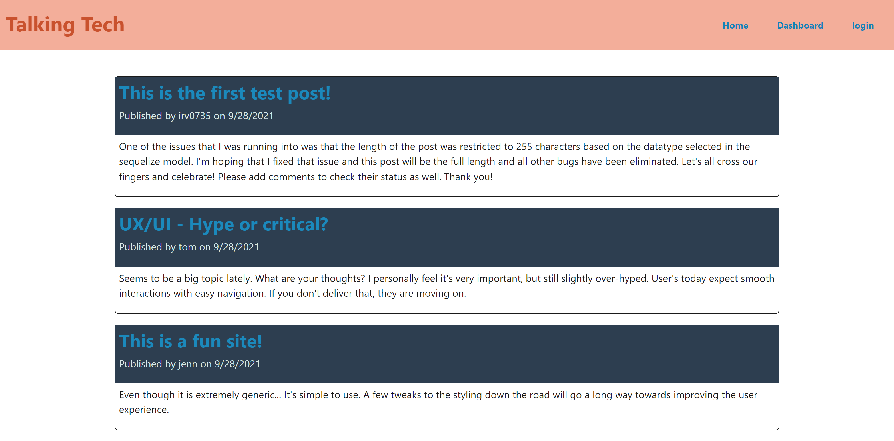

# Talking-Tech (MVC-Tech-Blog)
  
  
  
  ## Description
  CMS-Style Blog site that allows users to publish blog posts and comment/have discussion on the various blogs posted. All data/posts are stored on the server database for consumption when returning to the site at a later time. 

  ## Table of Contents
  * [Installation](#installation)
  * [Usage](#usage)
  * [Contributing](#contributing)
  * [Tests](#tests)
  * [License](#license)
  * [Questions](#questions)
  
  ## Installation
  No installation required. 

  ## Usage
  Available at [Live Heroku App](https://frozen-forest-35166.herokuapp.com/)
  

  ## Contributing
  Please fork and issue merge request for consideration

  ## Tests
  N/A

  ## License
  MIT License
  

  ## Questions
  If you have questions, you can reach me via Github:
  [irv0735](https://github.com/irv0735)

  Or contact via email:
  irv0735@gmail.com
